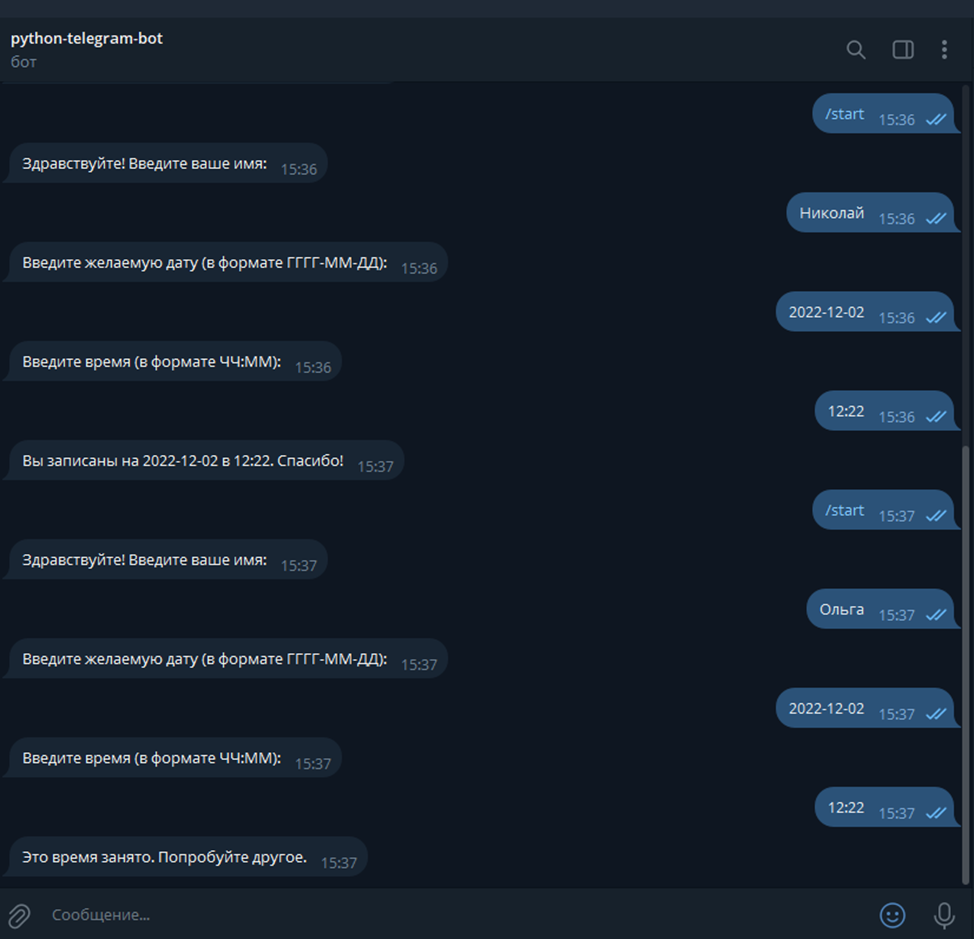

# telegram-bot-automation

Запись клиента на консультацию через Telegram-бота

🧩 Основные этапы бизнес-процесса (до автоматизации)
Этап	Описание
1. Инициирование	Клиент звонит/пишет в чат и просит записать его
2. Сбор данных	Сотрудник уточняет ФИО, контакт и желаемое время
3. Проверка расписания	Сотрудник вручную смотрит календарь/таблицу
4. Подтверждение	Клиенту сообщается, свободно ли это время
5. Запись	Вносится вручную в журнал Excel или бумажный блокнот
6. Напоминание	При необходимости — звонок/смс клиенту

🔁 Процесс после автоматизации (через бота):
Участники:

Клиент (пользователь Telegram)

Telegram-бот

Система хранения данных (например, SQLite)

Dash-дэшборд (пассивно собирает и отображает)

